# Pixel BUAA 开局指南

Pixel BUAA 基于 `STM32F042K6U6` 单片机，使用 `IS31FL3731` 灯控芯片对 7×11 的 LED 进行控制。在灯控板上，还有一层导光板和透光板，透光板绘制有老主楼的图案，在中央位置的每一个窗户里，设置了红、白两个颜色的 LED，其灵感来源于 2020 年“线上毕业”的主楼灯光秀。

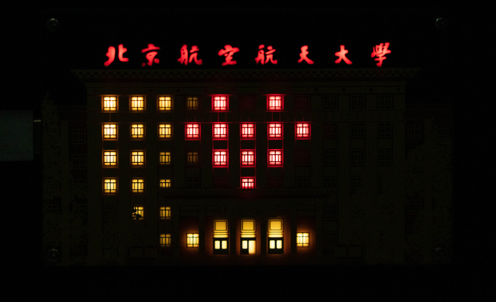

## 操作方法

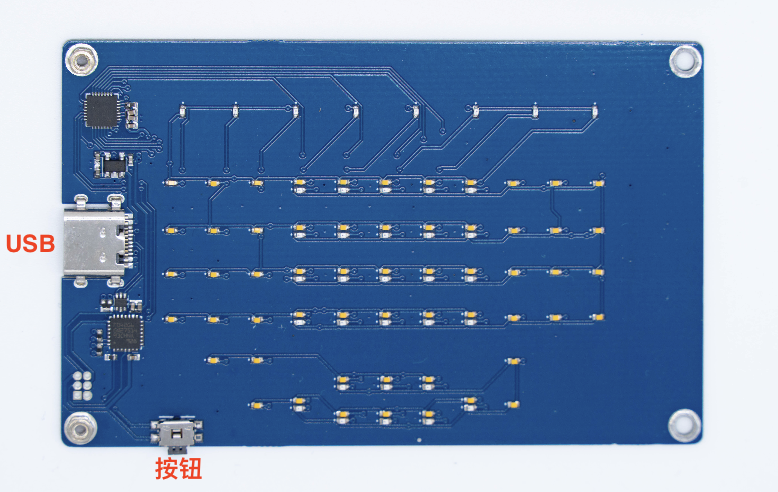

1. **插电开机**

    主楼会随机亮起，并随着时间的流逝而变化，校名的背景灯的亮度、每个窗口上班和下班的概率根据内部时间系统调整。**长按按钮**可以加速时间的流逝。

2. **输入字母**

    按照摩尔斯电码表，用按键“发电报”，发完一个字母后等待解码结果。特殊的字母将在显示完解码结果后开始**循环播放动画效果**，直至新的字母输入或检测到**开关长按**。

3. **添加新的效果**

    按住按钮插电，单片机进入 DFU 模式，等待程序加载。根据下面的教程搭建开发环境，开始创作自己的电子主楼吧！

## 配置环境

需要下载的软件：

- CLion: https://www.jetbrains.com/clion/download/
- ARM GCC （版本：**10.3-2021.10**): https://developer.arm.com/downloads/-/gnu-rm
- zadig (**仅限Windows**): https://zadig.akeo.ie/
- dfu-util: https://dfu-util.sourceforge.net/releases/

### ARM GCC 的安装

运行下载的 `gcc-arm-none-eabi-10.3-2021.10-win32.exe` 来安装 ARM 工具链，请在安装完成的页面勾选 `Add path to environment variable` 选项并去除前两个选项（**Add path 这个一定要选**），如下图所示。

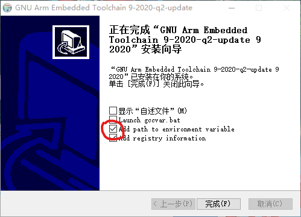

如果忘记勾选 `Add path to environment variable`，在创建 STM32 项目的时候， CMake 会抱怨找不到 `arm-none-eabi-gcc` 编译器，如果是这样，请将 GCC ARM 的 `bin` 目录添加进用户环境变量的 PATH 中，（然后重启计算机）如下图所示。

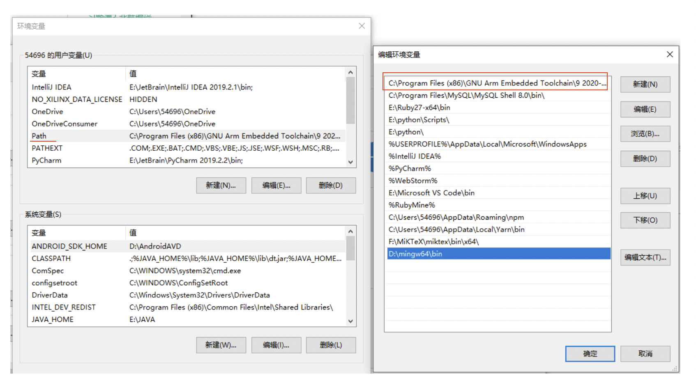

可以通过在命令提示符内输入以下命令来验证 ARM GCC 安装的正确性：

```arm-none-eabi-gcc -v```

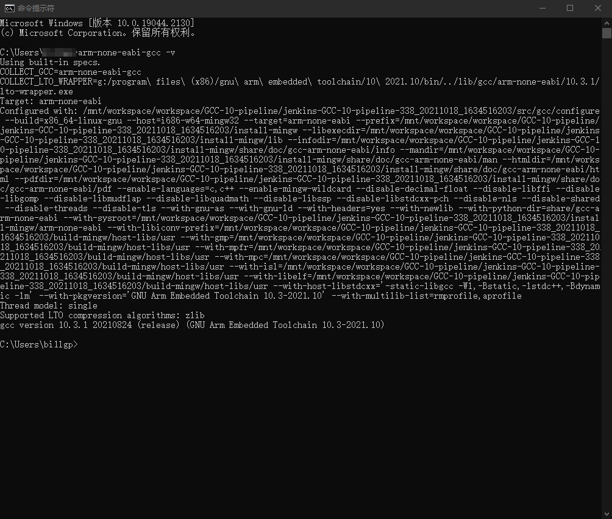

如果返回一长串配置信息，说明 ARM 工具链安装成功。

### CLion 的安装

下载官方的 CLion 安装包打开，然后一路 Next 安装。

安装后，会进行一些初始化配置的提示：首先是提示是否 Import Settings，选 Do Not Import；然后选择界面主题，按自己喜好选择即可；然后会有两个提示安装 Plugin 的界面，点击 Next 跳过不安装。

之后会出现提示激活许可的信息，如下图所示。JetBrains 对教育用户免费，只需注册一个 JetBrains 账号，然后用教育邮箱验证即可，具体请访问 [JetBrains 学习产品](https://www.jetbrains.com/shop/eform/students)，然后输入账号并点击绿色 Activate 按钮；如果此时不想激活，也可以选择如图红色圆圈所示的试用选项，试用 30 天再激活。

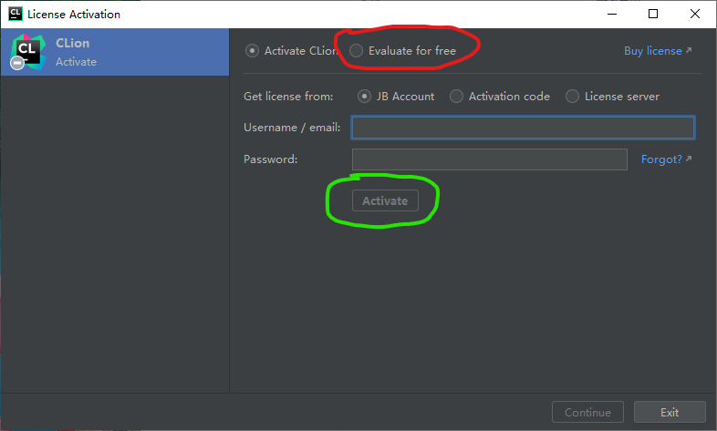

### 编译项目

在 Github 上下载固件项目。然后在 CLion 中打开这个项目。在主界面中点击 Open or Import，然后选择解压出的目录，如图所示。

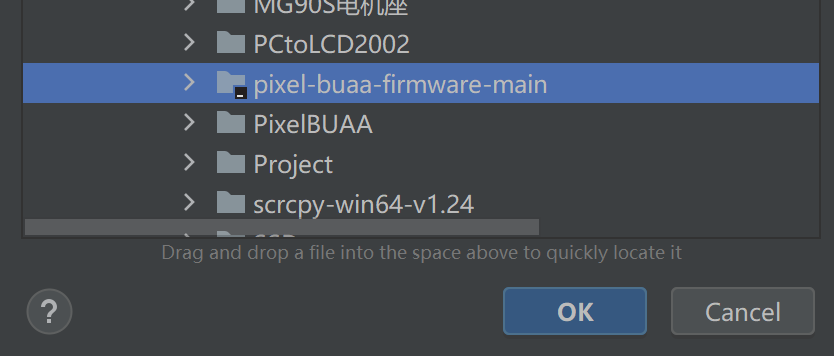

打开项目后，等待数秒让 CLion 完成索引工作，然后直接点击右上角的编译按钮（下图红圈）。点击后，应该能在左下角日志窗口看到编译生成固件的路径（下图绿圈）。

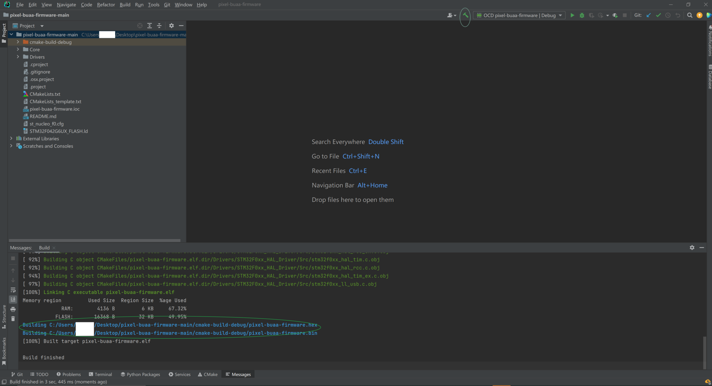

如果看到 Build finished 提示，就代表编译成功了。

### 上传固件

#### 安装 USB 驱动程序 （Windows）

找一条 USB Type-C 数据线，并将数据线插入开发板侧面（先不要连接电脑）。按下开发板下方的按钮不松开，然后将数据线的另一头插入电脑。插入后，等待 2 秒钟再松开按钮。此时电脑应该会有新设备连接的提示，并发出提示音。

:shipit: 为什么上电时要按住按钮不松开？

上电时，如果没有按住按钮，则单片机进入用户程序，此时单片机不启动 USB 功能，不能通过 USB 下载固件；上电时，如果按住按钮，则单片机进入 BOOTLOADER（烧写模式），此时才能与电脑通信。

下载 Zadig 并打开。初次打开时会提示是否自动检查更新，选择 Yes 即可。

先点击 Zadig 菜单栏 Options 中的 List All Devices 选项，然后在主界面下拉框中选择名为 STM32 BOOTLOADER 的设备，在右侧驱动选择（图中红框）中点按上下三角形按钮，选择 WinUSB 驱动，然后点击安装按钮（图中绿框），等待其安装完成。

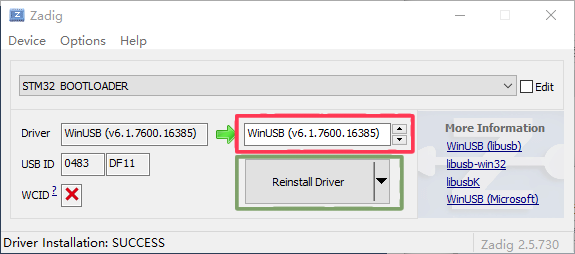

安装完成后，确认左侧 Driver 栏中为 WinUSB 驱动，设备管理器中 STM32 BOOTLOADER 旁边的黄色感叹号消失（如下图所示），然后可以关闭 Zadig。

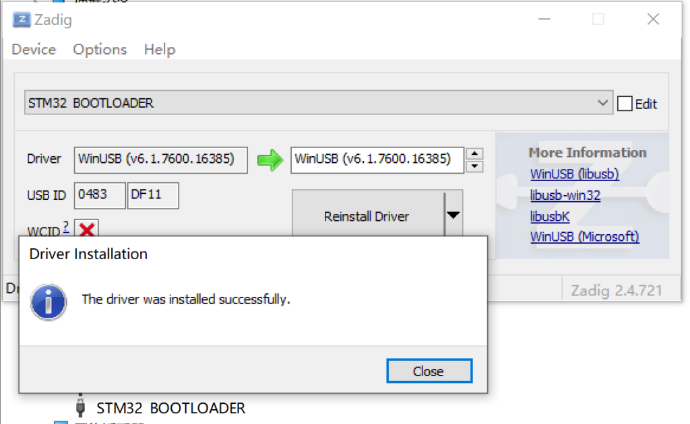

#### USB-DFU 下载

我们使用 dfu-util 工具来为单片机更新固件。

下载并解压 `dfu-util-0.9-win64.zip` （更加新的版本应该也 work）文件，将其放到你喜欢的地方。然后你需要将 dfu-util-0.9-win64 目录添加进 PATH 环境变量，具体方法不再赘述。

添加完成后，按键盘上的 Win+X 键，并在屏幕左下角的菜单中选择“Windows PowerShell”，打开 PowerShell。

按上节所述步骤，按住按钮，然后将开发板连接到电脑。在 PowerShell 中输入 dfu-util 列举设备的命令：

```dfu-util -l```

此时 dfu-util 应该可以找到单片机，如图中 Found DFU: [0483:df11] 开头的两行。每个单片机中有两个 DFU 节点，所以显示找到两个 DFU 信息是正常的。

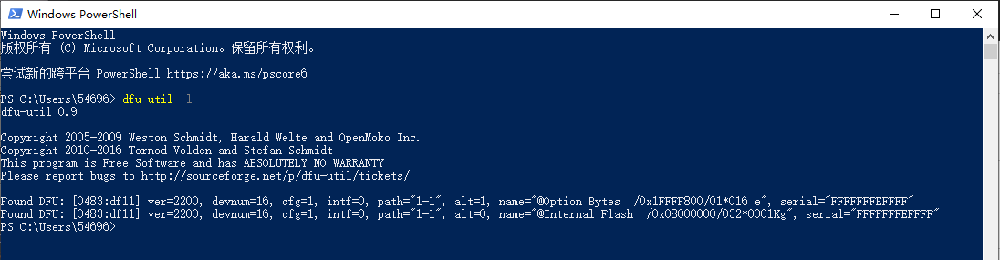

如果成功找到单片机，即说明驱动安装及 dfu-util 配置都是正确的。

要将固件写入到单片机中，你需要按住按钮，然后连接单片机。打开刚刚生成的固件文件所在目录（如图中为 `D:\PixelBUAA\cmake-build-debug`），点击左上角文件菜单中的“打开 PowerShell”选项，并输入写入固件的命令：

```dfu-util -a 0 -D PixelBUAA.bin --dfuse-address 0x8000000```

然后 dfu-util 就会自动向单片机发送固件。写入完成后的提示信息如下图所示。

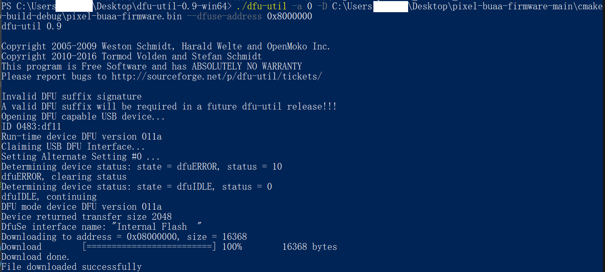

此时重新插入 USB 线（插入时不按住按键），单片机即可启动写入的程序。此时，会随机点亮随时间流逝的灯，按动按钮输入摩尔斯电码，字母会显示在卡片的中央，这是默认固件的功能。

如果需要再次写入程序，则拔掉 USB 线，按住按键，再插入 USB 线即可。

### 调试

你需要购买一个 ST-Link 或 JLink，和一个间距 1.27mm 2x3P 的编程夹子。接口的定义为：

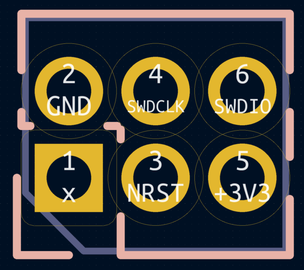